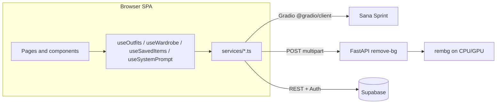

# Dressify — architecture (short)

Dressify is a **single-page outfit studio**: a **Vite + React 18 + TypeScript** client, an **optional FastAPI** microservice for segmentation, **Sana Sprint** (public Gradio) for image generation, and **optional Supabase** for auth and cloud persistence. Without Supabase, outfits, wardrobe, saved AI items, and the default system prompt still work via **localStorage**.

---

## Stack

| Area | Technologies |
|------|----------------|
| **Build & app shell** | [Vite](https://vitejs.dev/), React 18, TypeScript, path alias `@/` → `src/` |
| **Routing & data fetching** | React Router v6 (`BrowserRouter`, nested routes, `basename` for static hosting), [TanStack Query](https://tanstack.com/query) (`QueryClientProvider`) |
| **UI** | [Tailwind CSS](https://tailwindcss.com/), [shadcn/ui](https://ui.shadcn.com/) + [Radix UI](https://www.radix-ui.com/) primitives, [Sonner](https://sonner.emilkowal.ski/) / project toasts, [lucide-react](https://lucide.dev/) icons |
| **Auth & cloud DB** | [@supabase/supabase-js](https://supabase.com/docs/reference/javascript) (optional): auth session, Postgres-backed CRUD, Edge Functions |
| **Generation client** | [@gradio/client](https://www.gradio.app/guides/getting-started-with-the-python-client) → Sana Sprint public Space |
| **Background removal service** | Python 3.11+, [FastAPI](https://fastapi.tiangolo.com/), [Uvicorn](https://www.uvicorn.org/), [Pillow](https://python-pillow.org/), [rembg](https://github.com/danielgatis/rembg) (+ **ONNX Runtime** via rembg stack) |
| **Optional image edit** | Replicate model invoked from a **Supabase Edge Function** (`replicate-image-edit`), not from the browser directly |
| **Testing & quality** | [Vitest](https://vitest.dev/), ESLint (project scripts) |

**Local dev tooling:** Node **20.17** (`.nvmrc`), `npm`; backend via **`uv`** + `pyproject.toml` / `requirements.txt` (see `backend/README.md`).

### What each piece does

- **Vite** — Dev server and production bundler for the frontend: fast HMR, outputs static JS/CSS for hosting.
- **React 18** — UI library: components, state, and rendering in the browser.
- **TypeScript** — JavaScript with static types; catches errors at build time and improves editor support.
- **`@/` path alias** — Import shorthand (`@/components/...`) so paths stay short and stable when files move.
- **React Router** — Client-side routing: URLs like `/wardrobe` map to pages without full page reloads; `basename` makes the app work when hosted under a subpath (e.g. GitHub Pages repo URL).
- **TanStack Query** — Caching and lifecycle helpers for async/server state (available app-wide via `QueryClientProvider`).
- **Tailwind CSS** — Utility-first CSS: layout, spacing, colors via class names in JSX instead of large custom stylesheets.
- **shadcn/ui** — Copy-paste React components built on Radix; Dressify’s buttons, dialogs, etc. follow this pattern.
- **Radix UI** — Unstyled, accessible primitives (focus traps, keyboard nav, ARIA) that shadcn styles.
- **Sonner / toasts** — Small popup notifications for success, errors, and sync warnings.
- **lucide-react** — Icon set as React components (save, wardrobe, etc.).
- **@supabase/supabase-js** — Official browser client: sign-in, session refresh, and calls to Postgres REST/RPC and Edge Functions using the anon key (RLS enforces row access server-side).
- **@gradio/client** — JavaScript client that speaks the same protocol as a **Gradio** demo; Dressify uses it to call the hosted **Sana Sprint** UI/API as if it were a typed remote function.
- **Sana Sprint** — External image generation service (Han Lab); not part of your repo—your app is a client of it.
- **FastAPI** — Python web framework: defines `POST /remove-bg`, validates uploads, returns a PNG stream.
- **Uvicorn** — ASGI server that runs the FastAPI app in development/production.
- **Pillow (PIL)** — Loads/saves images in Python (bytes ↔ RGBA PNG) around `rembg`.
- **rembg** — Library that removes backgrounds using a pretrained segmentation model (often ONNX-backed).
- **ONNX Runtime** — Efficient runtime for ONNX models; pulled in as part of the `rembg` dependency chain to execute the model.
- **Replicate** — Hosted API that runs ML models; Dressify never calls it from the browser with a secret key.
- **Supabase Edge Function (`replicate-image-edit`)** — Serverless function in your Supabase project that holds the Replicate API key and returns an edited image URL to the client.
- **Vitest** — Unit/integration test runner aligned with Vite.
- **ESLint** — Static analysis for JS/TS style and common bugs (`npm run lint`).
- **Node / npm** — JavaScript runtime and package manager for installing and running the frontend.
- **uv** — Fast Python package and environment manager; runs the backend with locked dependencies.

---

## System shape

- **Client** runs the UI, owns session-scoped **generated items** in React state, and decides whether to read/write **localStorage** or **Supabase** based on configuration and session.
- **FastAPI** (`backend/main.py`) exposes `POST /remove-bg`: accepts an image, runs **`rembg`** (`utils/remove_background.py`), returns PNG with alpha.
- **Sana Sprint** is called from the browser via **`@gradio/client`** (`Client.connect` + `predict("/run", …)` in `src/services/sanaSprintApi.ts`) — no Dressify-owned inference server for generation.

---

## Frontend structure

| Layer | Role |
|--------|------|
| **`App.tsx`** | `QueryClientProvider`, theme/tooltip/toasts, `BrowserRouter` with `basename` for GitHub Pages, route table. |
| **`pages/Index.tsx`** | **App shell**: consent gate, header, nav, and a **studio context** (`useStudio`) holding `userPhoto`, `generatedItems`, `canvasItems`, `outfitName`, and wiring to outfit/wardrobe/saved-item hooks. Child routes render in `<Outlet />`. |
| **Pages** | `HomePage` (photo, generate, canvas, save flow), `WardrobePage`, `SavedPage` (items/outfits), `ProfilePage`, plus standalone auth routes. |
| **`components/`** | Feature UI: `GeneratePanel`, `CanvasEditor`, `WardrobeLibrary`, modals, etc.; `components/ui/` is shadcn/Radix. |
| **`hooks/`** | Persistence and sync: outfits, wardrobe, saved generated items, system prompt — each mirrors **local + Supabase** behavior. |
| **`services/`** | External I/O only: `sanaSprintApi.ts`, `backgroundRemoval.ts`, `*Supabase.ts`, optional Replicate edit helper. |
| **`lib/`** | Supabase client singleton, IDs, category normalization, errors. |

**TanStack Query** is available app-wide; **React Router** nests `/saved` with `items`, `outfits`, and `outfits/:outfitId`.

---

## Main features and how they are implemented

### 1. AI clothing generation

- **`GeneratePanel`** composes the final prompt: **user text + `useSystemPrompt` default + style template descriptor**, infers category (`detectClothingCategory`), then calls **`generateClothingItem`** in `sanaSprintApi.ts`.
- The service builds Gradio **`/run`** parameters (resolution, steps, timesteps as numeric fields where required), connects to `https://sana.hanlab.ai/sprint/`, parses the returned gallery into a **data URL or blob URL** for the UI, with **retry** on transient busy errors.
- New items get a client **`createId()`**, are appended to **`generatedItems`** in studio state, and can be placed on the board.

### 2. Canvas / outfit composition

- **`CanvasEditor`** maintains a list of **`CanvasItem`** objects: position (`x`, `y`), size, **rotation**, **`zIndex`**, optional **prompt**, and **`source`** (`ai` | `wardrobe`).
- Interaction is local: drag, resize handles, rotate, layer up/down, delete. **Custom drag MIME** `application/x-dressify-piece` (`CANVAS_PIECE_MIME`) lets drops from wardrobe/saved lists carry structured **piece payloads** without conflating with file uploads.
- **Background removal** for pieces uses **`removeBackgroundAdvanced`**: `fetch` image → `FormData` → **`VITE_API_URL` or `http://127.0.0.1:8000`** + `/remove-bg` → result as **data URL** for the canvas.

### 3. Wardrobe and saved items

- **`useWardrobe`** and **`useSavedItems`** list/add/delete/rename items; with Supabase + signed-in user they use **`wardrobeSupabase.ts`** and related tables; otherwise **localStorage** with user-visible sync warnings (`toast` from hook errors).
- **`Saved / Items`** merges **session generated** list with **persisted** wardrobe/saved-AI items for browsing; **generated history is not a separate long-lived DB feature** (per project README).

### 4. Saving and loading outfits

- **`useOutfits`** defines **`Outfit`**: name, timestamp, **snapshot of `canvasItems`**, optional **`userPhoto`**.
- **Save**: serializes current board + photo into storage; **cloud path** uses **`outfitsSupabase.ts`** (CRUD + item rows / RPCs as implemented there). **Load** hydrates studio state from a stored outfit; **delete** removes locally or remotely.

### 5. Auth and consent

- **Supabase** is created only when `VITE_SUPABASE_URL` and `VITE_SUPABASE_ANON_KEY` are valid (`lib/supabase.ts`). Auth routes (`/login`, `/register`, `/auth/callback`) sit **outside** the `Index` shell.
- **`ConsentModal`** gates the studio on policy acceptance before full use of uploads/generation.

### 6. Optional image edit (Replicate via Supabase)

- **`ImageEditorDialog`** can **modify** an existing generated image with a new prompt: it calls **`editImageWithReplicate`** (`replicateImageEdit.ts`), which invokes the Supabase Edge Function **`replicate-image-edit`** (`supabase.functions.invoke`). That keeps the Replicate API key off the browser.
- **Requires** `isSupabaseConfigured`; if Supabase is missing, the UI throws a clear error (no silent fallback to Sana for this path — users rely on fresh generation instead).

---

## Configuration summary

| Variable | Purpose |
|----------|---------|
| `VITE_SUPABASE_URL`, `VITE_SUPABASE_ANON_KEY` | Supabase client, auth, cloud sync, and Edge Function calls; omit → local-only persistence, no Replicate edit. |
| `VITE_API_URL` | FastAPI base for `/remove-bg`; default `http://127.0.0.1:8000`. |
| `VITE_BASE_PATH` | Router/asset base (e.g. GitHub Pages). |
| `REPLICATE_API_TOKEN` | Used in **Supabase project** secrets for the `replicate-image-edit` function (not read by the Vite bundle). Dev startup may log whether a token is set for local tooling only. |

---

## Operational note

Run **frontend** (`npm run dev`, typically port **8080**) and **backend** (`uv run python main.py` in `backend/`, default **8000**) together when using server-side background removal; generation only needs network access to **Sana Sprint**.
